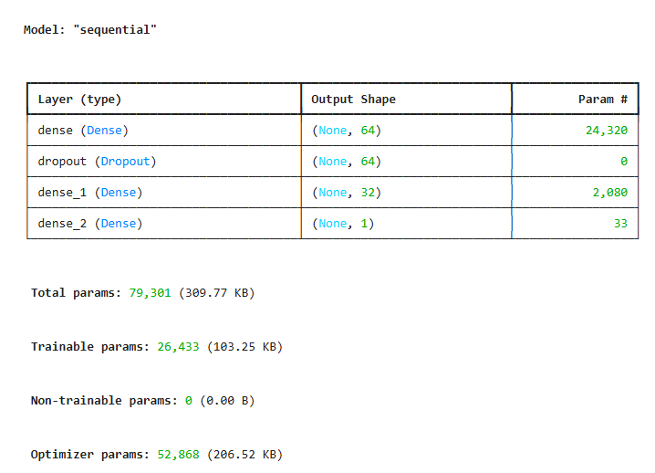
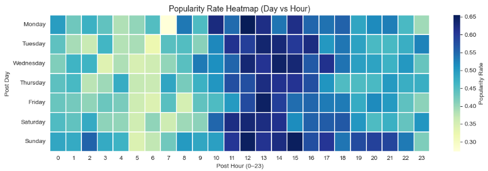
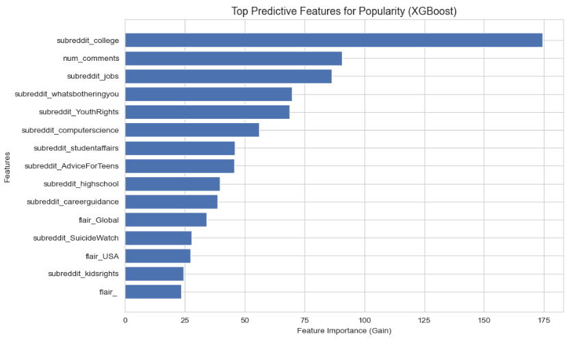
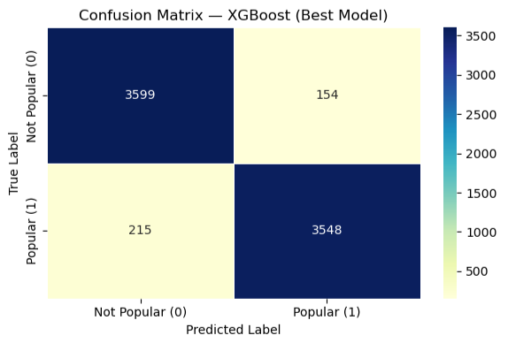

# Reddit Trend Prediction

Predictive modelling system for classifying whether a Reddit post is likely to become popular using machine learning.

This project was developed as my Final Year Project for the University of London BSc Computer Science programme.

---

## Project Overview

Reddit generates millions of posts across thousands of communities every day. While some posts receive significant attention, many receive little engagement.

This project investigates whether the popularity of a Reddit post can be predicted before publication using machine learning models trained on textual, metadata, and temporal features.

The project implements an end-to-end machine learning pipeline, from data preprocessing and feature engineering to model training, evaluation, and deployment through a Streamlit web application.

---

## Features

- Large-scale Reddit dataset
- Data cleaning and preprocessing
- Feature engineering
- TF-IDF text vectorisation
- Multiple machine learning models
- Model comparison
- Feature importance analysis
- Streamlit web application for live predictions

---

## Machine Learning Models

The following models were evaluated:

| Model |
|-------|
| Logistic Regression |
| Random Forest |
| XGBoost |
| Multi-layer Perceptron (Neural Network) |

---

## System Architecture



---

## Visualisations

### Popularity Rate Heatmap



---

### Feature Importance



---

### Confusion Matrix



---

## Streamlit Application

The trained model was deployed using Streamlit to allow users to predict Reddit post popularity interactively.

The application allows users to:

- Enter Reddit post information
- Select subreddit
- Choose posting time
- Predict popularity
- View prediction confidence


---

## Dataset

This project uses Reddit data collected from Kaggle.

The dataset is not included in this repository because of its size.

---

## Technologies Used

- Python
- Pandas
- NumPy
- Scikit-learn
- XGBoost
- Streamlit
- Matplotlib
- Seaborn
- Joblib

---

## Repository Structure

```text
reddit-trend-prediction/
│
├── README.md
├── app.py
├── reddit_popularity_prediction.ipynb
├── requirements.txt
│
├── models/
│   └── xgb_model.pkl
│
├── images/
│   ├── architecture.png
│   ├── confusion_matrix.png
│   ├── feature_importance.png
│   └── popularity_rate_heatmap.png
```

---

## How to Run

Clone the repository.

Install the required packages.

```bash
pip install -r requirements.txt
```

Launch the Streamlit application.

```bash
streamlit run app.py
```

---

## Future Improvements

Potential future enhancements include:

- Transformer-based language models (BERT)
- Real-time Reddit API integration
- Explainable AI (SHAP)
- Deep learning text embeddings
- Cloud deployment

---

## Author

**Li Ching**
